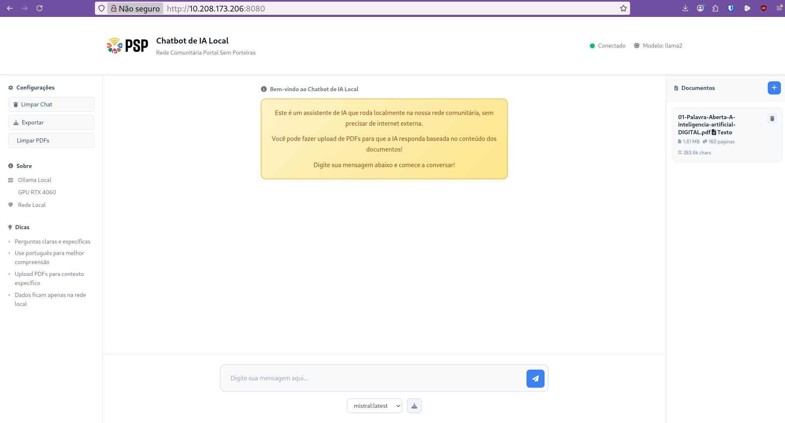

# 🤖 Chatbot de IA Local - Rede Comunitária Portal Sem Porteiras

Um chatbot de inteligência artificial que roda localmente na rede comunitária, sem necessidade de internet externa. Desenvolvido para a **Rede Comunitária Portal Sem Porteiras**.



## 🌐 Configuração de Rede

Este projeto utiliza a variável de ambiente **OLLAMA_HOST** para definir o endereço do servidor Ollama:
- **Padrão:** `http://localhost:11434` (ideal para rodar tudo na mesma máquina)
- **Para usar outro servidor na rede:** edite o arquivo `.env` e defina `OLLAMA_HOST` para o IP desejado, por exemplo: `http://10.208.173.206:11434`

> Exemplo de `.env`:
> ```
> OLLAMA_HOST=http://localhost:11434
> ```
> Ou para servidor remoto:
> ```
> OLLAMA_HOST=http://10.208.173.206:11434
> ```

**Sempre copie `.env.example` para `.env` e ajuste conforme seu ambiente!**

## ✨ Funcionalidades

- **IA Local**: Processamento local sem dependência de serviços externos
- **Aceleração GPU**: Suporte a GPU NVIDIA para processamento mais rápido
- **Upload de PDFs**: Faça upload de documentos PDF para que a IA responda baseada no conteúdo
- **Múltiplos Modelos**: Suporte a diferentes modelos de IA (LLaMA 2, Mistral, Code Llama)
- **Interface Web**: Interface moderna e responsiva
- **Histórico**: Salva e exporta conversas
- **Cache Inteligente**: Cache de PDFs processados para melhor performance

## 🚀 Instalação Rápida

### Pré-requisitos

- **Sistema**: Debian 12 ou Ubuntu 22.04+
- **GPU**: NVIDIA RTX 4060 ou superior (recomendado)
- **RAM**: Mínimo 8GB, recomendado 16GB+
- **Armazenamento**: 20GB livres para modelos e cache
- **Docker e Docker Compose**: Instalados
- **Acesso à rede local**: 10.208.173.206

### Deploy Automático

```bash
# Clone o repositório
git clone https://github.com/seu-repo/ia-local.git
cd ia-local

# Deploy inteligente (detecta mudanças automaticamente)
chmod +x deploy.sh
./deploy.sh
```

### Verificar Status

```bash
# Status dos containers
docker-compose ps

# Logs em tempo real
docker-compose logs -f chatbot

# Testar conectividade com servidor Ollama
curl http://10.208.173.206:11434/api/tags
```

## 🔧 Desenvolvimento

### Setup do Ambiente

```bash
# Configurar ambiente de desenvolvimento
chmod +x setup_dev.sh
./setup_dev.sh

# Executar em modo desenvolvimento
chmod +x run_dev.sh
./run_dev.sh
```

### Estrutura do Projeto

```
ia-local/
├── app.py                 # Aplicação principal Flask
├── pdf_processor.py       # Processamento de PDFs
├── templates/             # Templates HTML
├── static/                # CSS, JS, imagens
├── uploads/               # PDFs enviados pelos usuários
├── cache/                 # Cache de processamento
├── logs/                  # Logs da aplicação
├── docker-compose.yml     # Configuração Docker produção
├── docker-compose.dev.yml # Configuração Docker desenvolvimento
├── deploy.sh              # Script de deploy inteligente
└── requirements.txt       # Dependências Python
```

## 📚 Funcionalidades

### Chat com IA
- Interface web amigável
- Integração com modelo llama2 via Ollama
- Respostas rápidas usando GPU RTX 4060

### Upload e Processamento de PDFs
- Upload de múltiplos PDFs
- Extração de texto usando PyPDF2 e pdfplumber
- Uso do conteúdo como contexto para o chat
- Listagem e remoção de PDFs

### Interface Administrativa
- Gerenciamento de PDFs
- Logs de sistema
- Status de conectividade

## 🔗 Conectividade

### Servidor Ollama Remoto
- **URL**: `http://10.208.173.206:11434`
- **Modelo**: llama2
- **GPU**: RTX 4060 (no servidor remoto)

### Interface Web
- **URL**: `http://localhost:8080`
- **Porta**: 8080
- **Acesso**: Rede local

## 📊 Performance

### Métricas com GPU RTX 4060
- **Tempo de resposta**: 2-5 segundos
- **Utilização de memória**: ~6GB VRAM
- **Temperatura**: 45-55°C
- **Throughput**: ~15-20 tokens/segundo

### Comparação CPU vs GPU
- **CPU (antes)**: 30-60 segundos por resposta
- **GPU (agora)**: 2-5 segundos por resposta
- **Melhoria**: 10-15x mais rápido

## 🛠️ Comandos Úteis

### Docker
```bash
# Deploy inteligente
./deploy.sh

# Parar containers
docker-compose down

# Rebuild completo
docker-compose build --no-cache

# Ver logs
docker-compose logs -f chatbot

# Reiniciar apenas o chatbot
docker-compose restart chatbot
```

### Desenvolvimento
```bash
# Setup inicial
./setup_dev.sh

# Executar em desenvolvimento
./run_dev.sh

# Ativar ambiente virtual
source venv/bin/activate

# Instalar dependências
pip install -r requirements.txt
```

### Monitoramento
```bash
# Status do sistema
docker-compose ps

# Uso de recursos
docker stats

# Logs do sistema
tail -f logs/app.log

# Testar API
curl http://localhost:8080/api/health
```

## 🔍 Troubleshooting

### Problemas de Conectividade
```bash
# Verificar se servidor Ollama está acessível
curl http://10.208.173.206:11434/api/tags

# Verificar rede local
ping 10.208.173.206

# Verificar porta
telnet 10.208.173.206 11434
```

### Problemas de Performance
```bash
# Verificar uso de GPU no servidor remoto
nvidia-smi

# Verificar logs do Ollama
docker-compose logs ollama

# Verificar conectividade de rede
iperf3 -c 10.208.173.206
```

### Problemas de Deploy
```bash
# Limpar cache Docker
docker system prune -a

# Rebuild completo
docker-compose build --no-cache

# Verificar espaço em disco
df -h

# Verificar permissões
ls -la
```

## 📝 Logs e Monitoramento

### Logs da Aplicação
- **Localização**: `logs/app.log`
- **Nível**: INFO, ERROR, DEBUG
- **Rotação**: Automática

### Logs do Docker
```bash
# Logs do chatbot
docker-compose logs chatbot

# Logs do servidor Ollama (remoto)
# Verificar no servidor 10.208.173.206
```

### Métricas de Performance
- **Tempo de resposta**: Monitorado automaticamente
- **Uso de recursos**: Via Docker stats
- **Erros**: Logs estruturados

## 🔒 Segurança

### Rede Local
- Acesso restrito à rede local
- Sem exposição à internet
- Comunicação criptografada (se configurado)

### Uploads
- Validação de tipos de arquivo
- Limite de tamanho configurável
- Sanitização de conteúdo

## 🤝 Contribuição

### Para a Rede Comunitária
1. Teste as funcionalidades
2. Reporte bugs ou melhorias
3. Sugira novos recursos
4. Ajude na documentação

### Desenvolvimento
1. Fork do repositório
2. Crie uma branch para sua feature
3. Commit suas mudanças
4. Push para a branch
5. Abra um Pull Request

## 📞 Suporte

### Rede Comunitária Portal Sem Porteiras
- **Grupo**: [Link do grupo]
- **Canal**: [Link do canal]
- **Email**: [Email de contato]

### Documentação Adicional
- [PERFORMANCE.md](PERFORMANCE.md) - Análise detalhada de performance
- [PDF_FEATURE.md](PDF_FEATURE.md) - Documentação da funcionalidade de PDFs
- [TROUBLESHOOTING.md](TROUBLESHOOTING.md) - Guia de solução de problemas

---

**Portal Sem Porteiras** - Rede Comunitária Local
*IA Local para Todos* 🤖🌐

## 📄 Funcionalidade de PDF

### Como Usar

1. **Upload de PDF**: Clique no botão "Upload PDF" no painel lateral
2. **Seleção**: Arraste um arquivo PDF ou clique para selecionar
3. **Processamento**: O sistema extrai automaticamente o texto do PDF
4. **Ativação**: Clique em um PDF na lista para ativá-lo como contexto
5. **Chat**: A IA responderá baseada no conteúdo do PDF ativo

### Recursos

- **Extração Inteligente**: Usa múltiplos métodos para extrair texto (PyPDF2 + pdfplumber)
- **Cache**: PDFs processados são cacheados para evitar reprocessamento
- **Metadados**: Extrai título, autor, número de páginas e outras informações
- **Limite de Tamanho**: Máximo 16MB por arquivo
- **Contexto Limitado**: Limita o contexto enviado para a IA (2000 caracteres)

### Formatos Suportados

- ✅ PDFs com texto (recomendado)
- ✅ PDFs escaneados (OCR básico)
- ✅ PDFs com imagens e tabelas

## 🎯 Casos de Uso

### Para Redes Comunitárias

1. **Documentação Local**: Upload de manuais, regulamentos e documentos da comunidade
2. **Educação**: Material didático e apostilas para cursos locais
3. **Administração**: Processamento de formulários e relatórios
4. **Pesquisa**: Análise de documentos históricos da comunidade

### Exemplos Práticos

- **Manual da Rede**: "Como configurar um novo nó na rede?"
- **Regulamento**: "Quais são as regras para uso do servidor?"
- **Relatório**: "Resuma os principais pontos do relatório mensal"
- **Apostila**: "Explique o conceito de roteamento em redes"

## 🔧 Configuração

### Variáveis de Ambiente

```bash
# .env
OLLAMA_HOST=http://localhost:11434
MODEL_NAME=llama2
```

### Modelos Disponíveis

- **llama2**: Modelo geral (padrão)
- **mistral**: Modelo mais rápido e eficiente
- **codellama**: Especializado em código
- **llama2:13b**: Versão maior e mais precisa

### Baixar Novos Modelos

1. Acesse a interface web
2. Selecione o modelo desejado no dropdown
3. Clique em "Baixar Modelo"
4. Aguarde o download (pode demorar alguns minutos)

## 🛠️ Manutenção

### Logs

```bash
# Ver logs do chatbot
docker-compose logs chatbot

# Ver logs do Ollama
docker-compose logs ollama

# Logs de chat
tail -f logs/chat_history.json
```

### Backup

```bash
# Backup dos modelos
sudo docker run --rm -v ollama_data:/root/.ollama -v $(pwd):/backup alpine tar czf /backup/ollama-models-$(date +%Y%m%d).tar.gz -C /root/.ollama .

# Backup de PDFs e cache
tar czf backup-pdfs-$(date +%Y%m%d).tar.gz uploads/ cache/
```

### Limpeza

```bash
# Limpar cache de PDFs
rm -rf cache/*

# Limpar uploads
rm -rf uploads/*

# Limpar logs antigos
find logs/ -name "*.json" -mtime +30 -delete
```

## 🔍 Troubleshooting

### Problemas Comuns

1. **GPU não detectada**:
   ```bash
   nvidia-smi  # Verificar se GPU está funcionando
   sudo docker run --rm --gpus all nvidia/cuda:11.0-base nvidia-smi
   ```

2. **Modelo não baixa**:
   ```bash
   # Verificar espaço em disco
   df -h
   
   # Verificar logs do Ollama
   docker-compose logs ollama
   ```

3. **PDF não processa**:
   ```bash
   # Verificar dependências
   docker-compose exec chatbot pip list | grep -E "(PyPDF2|pdfplumber)"
   
   # Verificar logs
   docker-compose logs chatbot
   ```

4. **Interface não carrega**:
   ```bash
   # Verificar se porta está livre
   netstat -tlnp | grep 8080
   
   # Reiniciar serviços
   docker-compose restart
   ```

### Logs Detalhados

```bash
# Ativar logs detalhados
docker-compose up -d --build
docker-compose logs -f chatbot
```

## 🤝 Contribuição

Para contribuir com o projeto:

1. Fork o repositório
2. Crie uma branch para sua feature
3. Faça commit das mudanças
4. Abra um Pull Request

## 📄 Licença

Este projeto está licenciado sob a licença MIT - veja o arquivo [LICENSE](LICENSE) para detalhes.

## 🙏 Agradecimentos

- **Ollama**: Framework de IA local
- **Flask**: Framework web
- **NVIDIA**: Suporte a GPU
- **Comunidade Portal Sem Porteiras**: Testes e feedback

## 📞 Suporte

Para suporte técnico ou dúvidas:

- **Email**: suporte@portalsemporteiras.org
- **Telegram**: @portalsemporteiras
- **Issues**: GitHub Issues

---

**Desenvolvido com ❤️ para a Rede Comunitária Portal Sem Porteiras** 